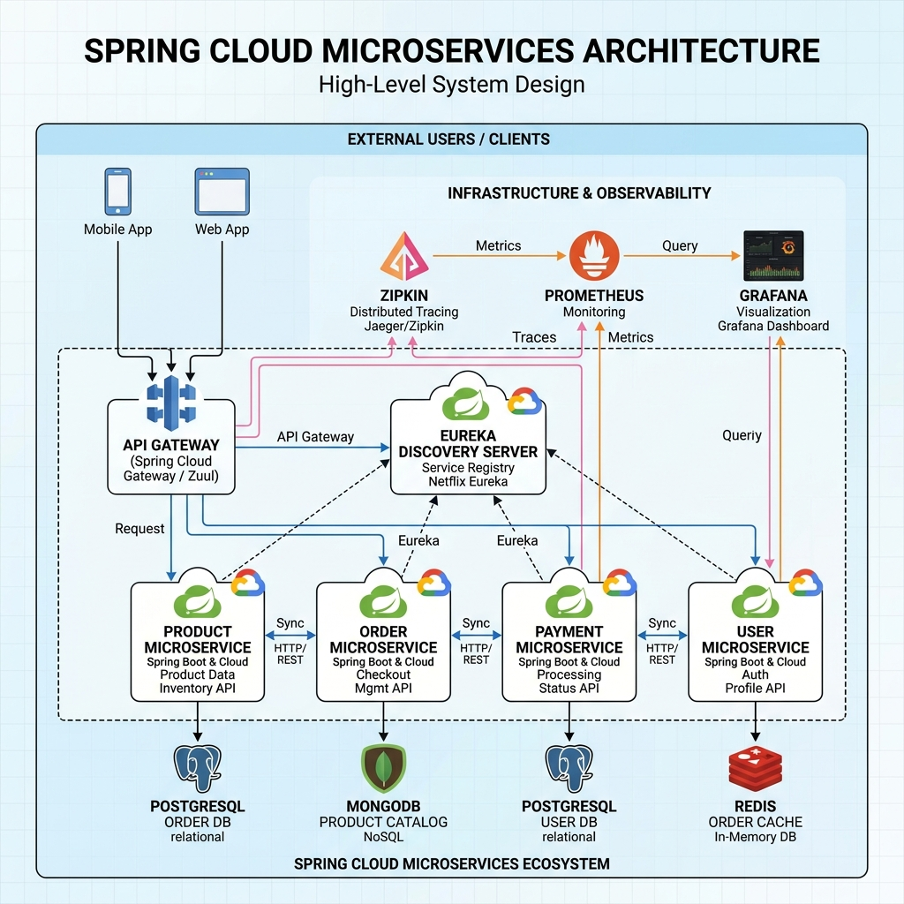
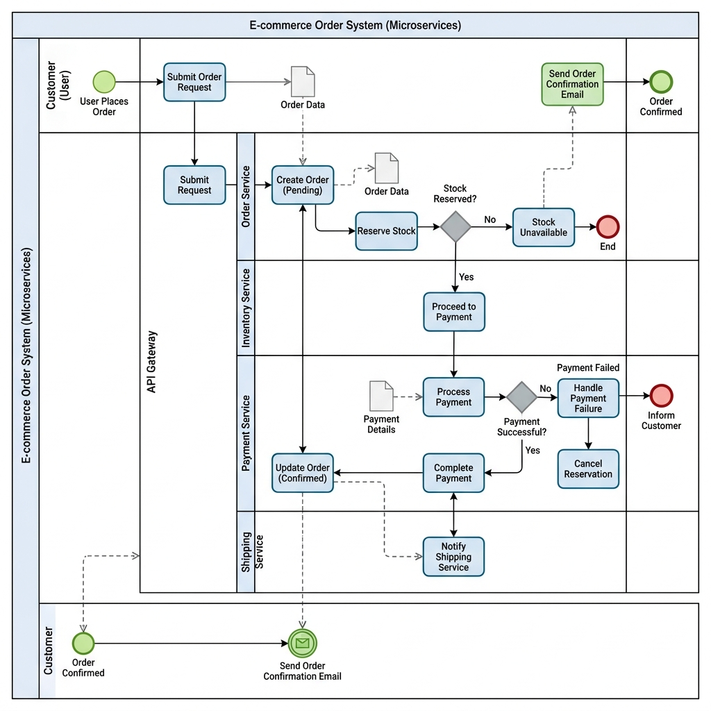
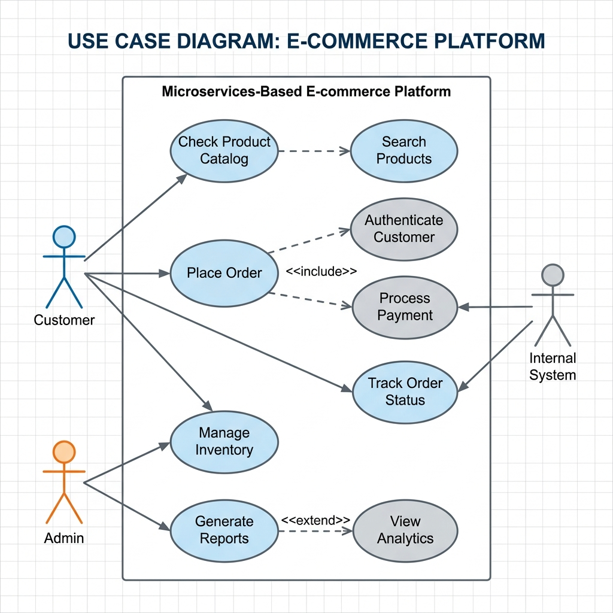
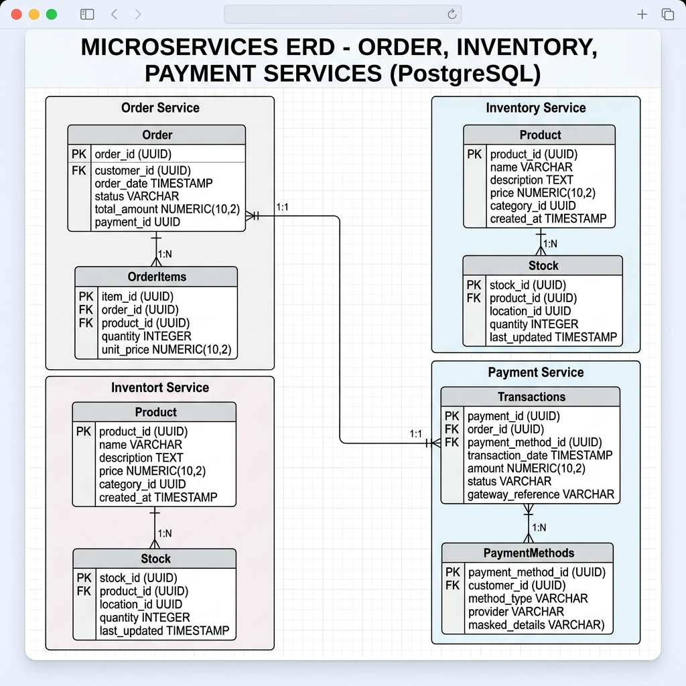

# 🚀 Sistema de Microservicios para E-Commerce

Este proyecto es una implementación robusta de un sistema de gestión de pedidos y productos utilizando una arquitectura de microservicios. Utiliza tecnologías de vanguardia para garantizar escalabilidad, resiliencia y monitoreo completo.

## 🏗️ Arquitectura del Sistema

El sistema se basa en una arquitectura de microservicios coreografiados y orquestados, utilizando **Spring Cloud** para el descubrimiento de servicios y el enroutamiento.



### Componentes Principales:
*   **Eureka Server**: Registro y descubrimiento de servicios.
*   **API Gateway**: Punto de entrada único con Circuit Breaker y Reintentos (Resilience4j).
*   **Microservicios**:
    *   **Product Service**: Gestión de catálogo (MongoDB + Redis Cache).
    *   **Order Service**: Gestión de pedidos (PostgreSQL).
    *   **Inventory Service**: Control de stock (PostgreSQL).
    *   **Payment Service**: Procesamiento de pagos (PostgreSQL).

## 📈 Procesos de Negocio

El flujo de pedidos sigue un proceso estándar de e-commerce, garantizando la consistencia de los datos entre servicios.



## 👤 Casos de Uso

El sistema soporta interacciones tanto para clientes finales como para administradores.



## 📊 Diseño de Base de Datos

Cada microservicio gestiona su propia persistencia para evitar el acoplamiento.



## 🛠️ Tecnologías Utilizadas

*   **Backend**: Java 17, Spring Boot 3.2.5, Spring Cloud 2023.0.1.
*   **Resiliencia**: Resilience4j (Circuit Breaker, Retry).
*   **Bases de Datos**: PostgreSQL, MongoDB, Redis.
*   **Observabilidad**:
    *   **Métricas**: Prometheus & Grafana.
    *   **Tracing**: Zipkin (OpenTelemetry).
    *   **Logging**: Loki & Promtail.
*   **Contenerización**: Docker & Docker Compose.

## 🚀 Cómo Ejecutar

### Requisitos:
*   Docker y Docker Compose instalados.
*   Java 17+ (para desarrollo local).

### Pasos:
1.  Clonar el repositorio.
2.  Navegar a la carpeta raíz de microservicios.
3.  Ejecutar el siguiente comando para levantar todo el entorno:
    ```bash
    docker-compose up --build
    ```
4.  Acceder a los servicios:
    *   **Gateway**: `http://localhost:9090`
    *   **Eureka**: `http://localhost:8761`
    *   **Grafana**: `http://localhost:3001`
    *   **Zipkin**: `http://localhost:9411`

## 🔗 Endpoints Principales (vía Gateway)
*   **Productos**: `GET /api/product`
*   **Pedidos**: `POST /api/order`
*   **Inventario**: `GET /api/inventory`
*   **Pagos**: `POST /api/payment`
---

